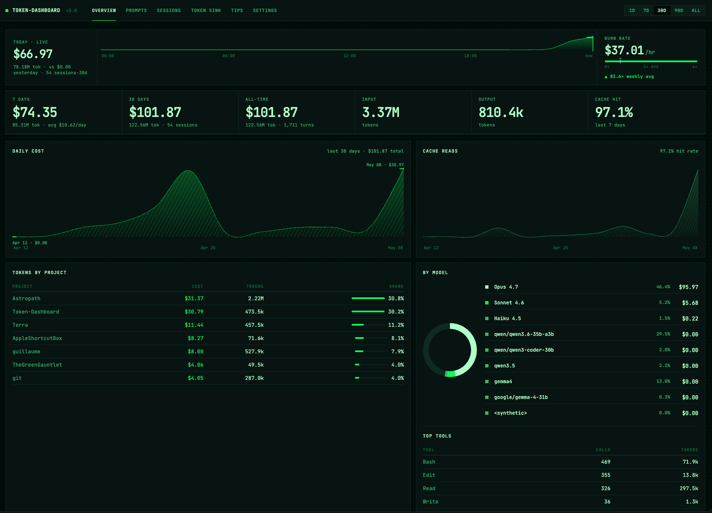

# Token Dashboard

[](https://www.buymeacoffee.com/Arylmera)



## Install

Pre-built installers ship for every `v4.*` tag —
[**latest release**](https://github.com/Arylmera/Token-Dashboard/releases/latest).

### Windows (.msi)

```powershell
curl.exe -L -o token-dashboard.msi https://github.com/Arylmera/Token-Dashboard/releases/latest/download/Token.Dashboard_x64_en-US.msi
msiexec /i token-dashboard.msi
```

Installs to `%LOCALAPPDATA%\Programs\Token Dashboard\` with Start Menu
shortcuts. SmartScreen will warn about an unrecognized publisher on
first launch — click *More info* → *Run anyway*. The bundle is unsigned
for now.

### macOS (Apple Silicon)

One-line install:

```bash
curl -fsSL https://raw.githubusercontent.com/Arylmera/Token-Dashboard/main/scripts/install.sh | bash
```

What it does: downloads the latest `*.dmg` from the GitHub releases API,
copies `Token Dashboard.app` to `/Applications`, runs `codesign --force
--deep --sign -` to fix the Team-ID dyld mismatch that otherwise breaks
unsigned bundles on macOS 14+, and launches the app. Source:
[`scripts/install.sh`](scripts/install.sh).

> ⚠️ The script is unsigned plain text. Open the URL in your browser
> first if you'd rather review the commands before piping them to bash.

Manual alternative — drag `Token Dashboard.app` from the `.dmg` to
`/Applications`, then:

```bash
codesign --force --deep --sign - "/Applications/Token Dashboard.app"
open -a "Token Dashboard"
```

### Linux (.AppImage / .deb)

```bash
# AppImage — runs anywhere
curl -L -o token-dashboard.AppImage https://github.com/Arylmera/Token-Dashboard/releases/latest/download/token-dashboard_amd64.AppImage
chmod +x token-dashboard.AppImage
./token-dashboard.AppImage

# Debian / Ubuntu
curl -L -o token-dashboard.deb https://github.com/Arylmera/Token-Dashboard/releases/latest/download/token-dashboard_amd64.deb
sudo dpkg -i token-dashboard.deb
```

> Single binary, ~5–10 MB installer. No Python, no Node, no Chromium —
> Tauri 2 + WebView2 / WebKit on the system side.

## About

**See exactly where your Claude Code tokens go.** Token Dashboard is a
local desktop app that turns the JSONL transcripts in
`~/.claude/projects/` into per-prompt cost analytics, tool and file
heatmaps, subagent attribution, cache analytics, project comparisons,
and a tips engine that flags expensive patterns before your next bill
does.

100% local. No telemetry. No login. No data leaves your machine.

## What you get

| Tab | What it answers |
|-----|----------------|
| **Overview** | Top-line totals, cost per day, stacked input / output / cache breakdown, daily budget burn. |
| **Prompts** | Your most expensive user prompts, joined to the assistant turn that followed — find the question that cost $4 in cache misses. |
| **Sessions** | Recent sessions with cost, model, tags, and per-turn drill-down. |
| **Projects** | Per-project aggregation with worktree-fold so a parent repo doesn't fragment into N rows. |
| **Skills** | Invocation counts and per-call context cost from `~/.claude/skills/`. See which skills earn their token budget. |
| **Tips** | Rule-based suggestions: low cache hit rate, repeated file reads, Opus-on-tiny-turns, retry storms, oversized tool results. |
| **Settings** | Plan, budget caps, badge metric, glass mode, source attachment, pricing overrides. |

Inspired by [phuryn/claude-usage](https://github.com/phuryn/claude-usage)
— diverges in scope (expensive-prompt drill-down, skills, tips,
streaming-snapshot dedup) and in look (dark theme, hash router, SSE
refresh).

## Privacy

Fully offline. The one optional network call is the **Sync limits**
button in Settings: it hits the Anthropic Messages API with a key *you*
save to read rate-limit headers, and stays disabled until you save a
key. Everything else — scanning, parsing, pricing, the SSE feed, the
tips engine — runs against local files only.

## Developer documentation

Building from source, architecture, configuration, and contribution
notes live in [**docs/DEVELOPMENT.md**](docs/DEVELOPMENT.md).

## License

[MIT](LICENSE).
